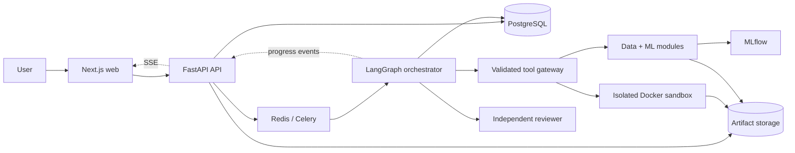
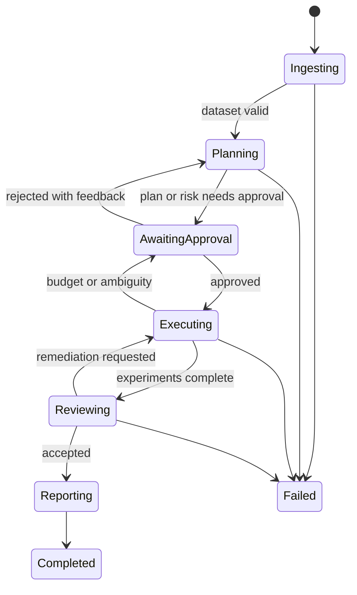

# Project Blueprint

## 1. Tóm tắt

Agentic ML Research Copilot là ứng dụng web giúp người dùng biến một dataset dạng bảng
và yêu cầu tự nhiên thành một quy trình ML có kiểm soát. Hệ thống lập kế hoạch, thực thi
công cụ, huấn luyện và so sánh model, tự review phương pháp, xin phê duyệt tại các điểm
rủi ro và xuất đầy đủ artifact để tái lập.

Sản phẩm không nên được định vị là AutoML tổng quát. MVP là một **research copilot có
audit trail**, ưu tiên quy trình đúng và giải thích được hơn việc thử thật nhiều model.

## 2. Người dùng và giá trị

Người dùng chính là sinh viên, analyst, junior data scientist và nhóm sản phẩm cần một
baseline ML đáng tin cậy.

Đầu vào:

- CSV/Parquet và metadata tùy chọn;
- target, loại bài toán, metric, cột ID/thời gian/cấm dùng;
- budget về thời gian, experiment, CPU/RAM và seed.

Đầu ra:

- kế hoạch đã được người dùng duyệt;
- EDA và cảnh báo chất lượng/leakage;
- experiment có cấu hình, log, metric và model artifact;
- bảng so sánh có baseline;
- nhận xét độc lập của reviewer;
- report Markdown/PDF và mã/config để chạy lại.

## 3. Ranh giới MVP

Bao gồm:

- binary/multiclass classification và regression;
- dữ liệu bảng vừa với giới hạn một worker 4 GB RAM;
- holdout, stratified split, group split và time-aware split;
- scikit-learn, XGBoost hoặc LightGBM theo allowlist;
- một workflow chạy tại một thời điểm trên máy phát triển 16 GB RAM.

Chưa bao gồm:

- deep learning, image/audio/text pipelines;
- distributed training hoặc multi-agent chạy đồng thời;
- arbitrary package installation và network trong sandbox;
- production-grade multi-tenant billing;
- tự động deploy model ra serving.

## 4. Kiến trúc logic

Nguyên tắc phân rã:

- **API** xác thực, authorization, upload/download và stream event; không chứa logic ML.
- **Orchestrator** quản lý state machine, budget, retry, approval và tổng hợp; không tự
  truy cập hạ tầng ngoài tool contract.
- **Data/ML** là thư viện deterministic, có thể test độc lập không cần LLM.
- **Sandbox** là trust boundary riêng cho code không tin cậy.
- **Reviewer** đọc evidence đã lưu và đưa ra verdict có cấu trúc; không sửa experiment.
- **Persistence** tách metadata giao dịch (PostgreSQL), tracking (MLflow), artifact lớn
  (S3/MinIO) và queue/state ngắn hạn (Redis).

## 5. Luồng chính

Mỗi transition phải có actor, timestamp, reason, correlation ID và idempotency key. State
được checkpoint trước khi chờ người dùng; resume không được tạo experiment trùng.

## 6. Domain model tối thiểu

| Entity | Trách nhiệm |
|---|---|
| Project | ownership, mục tiêu và cấu hình mặc định |
| DatasetVersion | storage URI, schema, fingerprint, target và cột bị cấm |
| WorkflowRun | request, plan, trạng thái, budget và approval |
| ToolInvocation | input/output đã validate, thời gian, lỗi và trace ID |
| Experiment | dataset fingerprint, split, pipeline, model, seed, code version |
| MetricResult | split, metric, value, uncertainty/notes |
| ReviewVerdict | findings, severity, evidence và remediation |
| Artifact | loại, checksum, URI, MIME type, size và lineage |
| Approval | decision, actor, scope, reason và expiry |

Không dùng MLflow làm database nghiệp vụ. PostgreSQL giữ entity và quan hệ; MLflow là
tracking backend và được liên kết bằng `experiment_id`.

## 7. Tool contract

MVP gồm `inspect_dataset`, `profile_dataset`, `query_dataset`, `generate_plot`,
`run_python`, `train_model`, `evaluate_model`, `compare_experiments`,
`save_artifact`, `request_approval`, `generate_report`.

Mọi tool cần:

- Pydantic input/output có `schema_version`;
- timeout, resource budget và idempotency key;
- lỗi phân loại được (`validation`, `transient`, `policy`, `execution`, `internal`);
- artifact manifest thay vì trả binary trực tiếp;
- log đã lọc secret và giới hạn kích thước;
- audit event liên kết workflow/experiment/trace.

## 8. Quy tắc ML

- Chọn split trước preprocessing; time/group semantics có ưu tiên hơn random split.
- Mọi transformer được fit chỉ trên train fold và đóng gói trong pipeline.
- Baseline bắt buộc: dummy + mô hình tuyến tính phù hợp trước model phức tạp.
- Metric chính phải gắn với mục tiêu; imbalance không mặc định dùng accuracy.
- Reviewer kiểm tra target leakage, contamination, post-outcome features, duplicate
  cross-split, overfitting, metric mismatch và kết luận vượt quá evidence.
- Dataset fingerprint phải phụ thuộc vào bytes/content, schema và lựa chọn target/cột.
- Report phải phân biệt rõ validation score với ước lượng production performance.

## 9. Trust boundaries

Code LLM sinh ra là dữ liệu không tin cậy. Sandbox bắt buộc:

- root filesystem read-only, workspace tạm riêng, non-root user;
- network `none`, drop capabilities, no privileged mode, no Docker socket;
- CPU/RAM/PID/time/disk/output limits;
- image digest cố định và package allowlist;
- artifact path normalization, checksum và malware/content checks phù hợp;
- container bị hủy sau job; không tái sử dụng workspace giữa người dùng.

Approval không thay thế security control. Người dùng không thể “approve” việc mount host
filesystem hoặc chạy privileged container.

## 10. Observability và evaluation

Trace tối thiểu liên kết `request -> workflow -> node -> tool -> experiment -> artifact`.
Ghi duration, token, chi phí ước tính, retry, error class, decision, approval và resource use;
không ghi raw dataset hoặc secret vào trace.

Benchmark cố định cần đo:

- task completion và code/tool execution success;
- phát hiện leakage, chọn metric và validation đúng;
- khả năng vượt baseline;
- reproducibility;
- latency, token/cost và tỷ lệ cần can thiệp;
- safety-policy violation bằng 0 cho các case sandbox bắt buộc.

## 11. Rủi ro lớn và cách giảm

| Rủi ro | Cách giảm |
|---|---|
| Scope quá rộng | Khóa MVP vào tabular supervised và một worker |
| Agent loop tốn chi phí | Budget cứng, max step, max experiment, stop reason |
| Kết quả ML sai nhưng hợp lý bề ngoài | Deterministic tools + reviewer + eval fixtures |
| RCE/thoát sandbox | Boundary riêng, deny-by-default, adversarial integration tests |
| Không tái lập được | Fingerprint, seed, lockfile, image digest, code/config artifact |
| Contract drift frontend/backend | Pydantic là nguồn chính, sinh TypeScript trong CI |
| Workflow mất khi chờ approval | Durable checkpoint và idempotent resume |

## 12. Definition of MVP success

MVP hoàn thành khi một người dùng có thể upload dataset mẫu, duyệt plan, quan sát tiến
trình, nhận ít nhất baseline và một candidate model, xem reviewer verdict, tải report/artifact,
sau đó chạy lại với cùng config để nhận kết quả trong dung sai đã định. Tất cả thao tác đều
có audit trail và adversarial sandbox tests không thể truy cập network/host.
